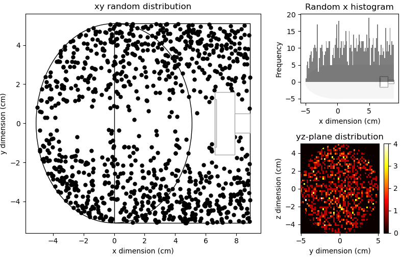
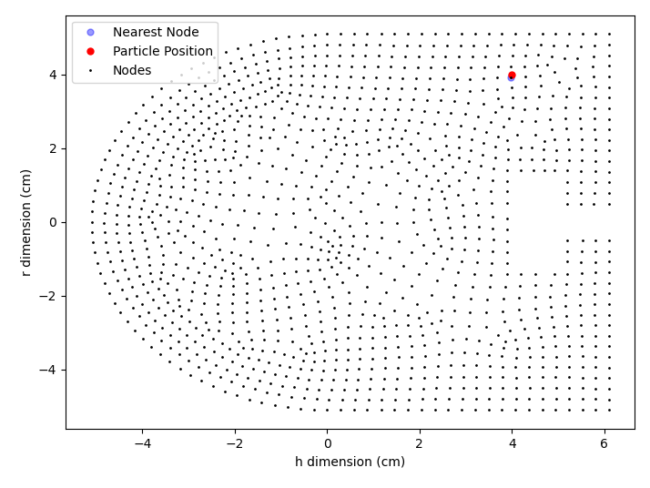

# Monte Carlo Simulation of Radon Collection in Different Gases

This repository contains the code and results for a Monte Carlo simulation of radon collection in different gases.

## Project Overview

This project aims to enhance our understanding of the collection efficiency of radon in various gases - a crucial aspect in research and industry. While experimental methods to derive this data exist, they are time-consuming and require access to various gases. This project presents an alternative - a Monte Carlo simulation that can predict a detector's response in different gases. While there have been previous simulations of electrostatic collection, this project specifically models the widely-used DURRIDGE RAD7 device and accounts for chemical neutralization processes, which are known to significantly impact collection.

## Table of Contents
1. [Project Overview](#project-overview)
2. [Dependencies](#dependencies)
3. [Electrostatic Collection Mechanism](#electrostatic-collection-mechanism)
4. [Modelling Electrostatic Collection Chamber E-Field](#modelling-electrostatic-collection-chamber-e-field)
5. [Simulating Radon Generation and 218Po+ Transport](#simulating-radon-generation-and-218po-transport)
6. [Running the Simulation](#running-the-simulation)
7. [References](#references)

## Dependencies

The following packages, modules, and software are needed to run the code contained in this repository:

### Software
- Python 3.8+
- ANSYS Mechanical v16.1
- SRIM (Stopping and Range of Ions in Matter)

### Python Modules
- numpy
- scipy.spacial
- matplotlib
- pandas
- shapely

### Random Packages (numpy)
- uniform
- random
- normal

## Electrostatic Collection Mechanism

The electrostatic collection process with RAD7 starts by sampling the gas of interest into the detector chamber. When 222Rn atoms enter the detector chamber, they distribute randomly as they are neutral and not responsive to the electric field. Post 222Rn alpha decay, a fraction of produced 218Po atoms becomes charged 218Po+ ions, which, if unneutralized, will continue their trajectory towards the detector due to the electric field. During its flight, 218Po+ is subject to collisions with carrier gas particles, which can cause deviations in its path. If the 218Po+ ion lands on the active surface of the detector, it is counted as a successful flight. If it lands elsewhere, it is counted as lost. It's important to note that the actual signal measured by the RAD7 is the alpha decay of the collected 218Po, which has a 50% chance of decaying into the detector's active surface.

## Modelling Electrostatic Collection Chamber E-Field

The electrostatic chamber and PIPS detector inside the RAD7 were modeled using ANSYS based on manufacturer dimensions. The chamber is a hemisphere on top of a cylinder, with a height of 6.1 cm, and a radius of 5.1 cm. The PIPS detector is placed along the cylinder axis on the flat side and has an active surface area of π(0.973 cm)².

The cylindrical symmetry of the electric field chamber was exploited to simplify the ANSYS electric field calculation from 3D to 2D by using cylindrical coordinates. ANSYS was used to simulate this geometry, which includes input parameters for material attributes and voltages. The walls and PIPS detector were modeled as metal, while the volume inside the chamber was modeled as gas. The chamber walls were set to a high voltage of 2500V, while the PIPS detector was set to 0V.

ANSYS generates an output file containing information about the magnitude and direction of the electric field for a mesh of nodes in the chamber. This electric field nodal map will be utilized in the simulation of 218Po+ drift.

## Simulating Radon Generation and 218Po+ Transport

Now that the RAD7 electric field chamber has been modeled, radon generation inside the chamber and particle tracking of the 218Po ion are simulated using the Python modules numpy [^1] and SciPy [^2]. Recoil losses are modeled using the calculated 218Po ion ranges from the SRIM (Stopping and Range of Ions in Matter) simulation package [^3].

The simulation starts with the generation of radon positions in the chamber. Since radon is uncharged, it is invisible to the electric field in the chamber and will distribute randomly in the chamber volume. The numpy.random package is used to generate random positions in the h and r coordinates inside the chamber. However, due to simplifying the 3D volume to 2D cylindrical coordinates, two corrections are made to the generation of random r coordinates. The first is that the r coordinate is a function of h and is limited as the height of the hemisphere is approached. The second is that the probability density function for generated r must grow with increasing r. This is because a larger r results in a bigger chamber volume, allowing for more possible points in the r coordinate.

The simulation then models recoil losses during radon decay. Once a 222Rn atom is generated in the chamber, it can alpha decay, causing the 218Po atom to recoil in a random direction. The recoil range of 218Po depends on the carrier gas species, temperature, and pressure, which can be calculated using the SRIM simulation package [^3].

A positively charged 218Po atom produced from 222Rn decay will drift towards the PIPS detector due to the electric field in the chamber. However, 222Rn decay only results in 88% of 218Po atoms being positively charged. Since neutral 218Po atoms are unresponsive to the electric field, they will not be collected. To simulate this, 222Rn decay is defined with a function that has a 12% probability of producing a neutral 218Po atom.

If a positively charged 218Po ion is produced, its drift trajectory is simulated by calculating the drift velocity, ν(r,h), due to the electric field, E(r,h), using the mobility of the 218Po ion for a specific carrier gas. The mobility can be calculated using Equation (1) derived in the Carrier Gases Effect section. The position of the 218Po ion will change during a simulation time step dt due to the drift velocity gained from the local electric field. The nearest electric field node solution from ANSYS is determined using the SciPy.Spatial module [^2]. Updates to the position of the 218Po ion due to the velocity gain from the nearest electric field node solution are repeated until an endpoint is reached.

Examples of 218Po ion tracking in the simulation are shown below. The black track corresponds to a successful collection, where the 218Po lands on the PIPS detector's active surface. The red track is an example of a trajectory landing on the detector case resulting in the loss of the ion.

During transport, the trajectory of the 218Po ion can be affected due to collisions with carrier gas particles. The collision causes a small deviation in the 218Po ion's path toward the PIPS detector. The fluctuation in the trajectory is modeled in the simulation using root mean displacement, MSD, which is calculated based on the diffusion coefficient of the 218Po ion for a specific carrier gas and the time step dt.

Loses due to 218Po decay during flight can be neglected, as the maximum flight time of 218Po is much smaller than the mean lifetime of 218Po decay. Only 218Po produced in the chamber is collected as the RAD7 uses a filter to stop any radon progeny already present in the gas sample from entering the chamber. Therefore, any 218Po in the chamber will have a mean lifetime of 4.5 minutes. The maximum flight time of 218Po in the chamber can be approximated by considering the maximum distance possible between a 218Po and the active surface in the detector, and the approximate electric field in the chamber [^3].

## Running the Simulation

### Inputs

This simulation requires inputs from the following sources:
- ANSYS Mechanical v16.1: The electrostatic field data is generated by ANSYS Mechanical software. The output file from ANSYS is used as an input for this simulation.
- SRIM

## References

[^1]: Harris, C.R., Millman, K.J., van der Walt, S.J., Gommers, R., Virtanen, P., Cournapeau, D., ... & Oliphant, T.E. (2020). Array programming with NumPy. Nature, 585(7825), 357-362.
[^2]: Virtanen, P., Gommers, R., Oliphant, T.E., Haberland, M., Reddy, T., Cournapeau, D., ... & van der Walt, S.J. (2020). SciPy 1.0: fundamental algorithms for scientific computing in Python. Nature Methods, 17(3), 261-272.
[^3]: James, R.B. (2008). Stopping and Range of Ions in Matter (SRIM). SRIM Co., Menlo Park, CA, USA.

